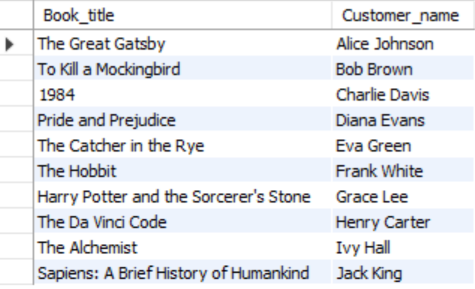
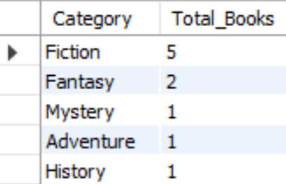
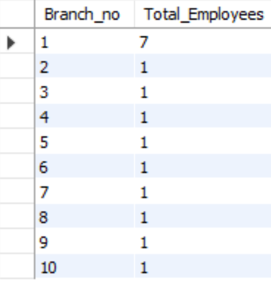
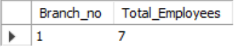

# Library-Management-System-MySQL
This project is a **Library Management System** implemented using MySQL. It includes a database schema, sample data, and SQL queries to manage library operations such as book issuance, returns, and employee management.
---

## Table of Contents

1. [Project Overview](#project-overview)
2. [Database Schema](#database-schema)
3. [Sample Data](#sample-data)
4. [SQL Queries](#sql-queries)
5. [Screenshots](#screenshots)
6. [How to Run](#how-to-run)
7. [Contributing](#contributing)
8. [License](#license)

---

## Project Overview

The Library Management System is designed to keep track of:
- Books (title, category, rental price, availability, etc.)
- Branches (address, contact details, etc.)
- Employees (name, position, salary, etc.)
- Customers (name, address, registration date, etc.)
- Book issuance and return status.

---

## Database Schema

The database consists of the following tables:
1. **Branch**: Stores branch details.
2. **Employee**: Stores employee details.
3. **Books**: Stores book details.
4. **Customer**: Stores customer details.
5. **IssueStatus**: Tracks issued books.
6. **ReturnStatus**: Tracks returned books.

---

## Sample Data

The database is populated with sample data for testing:
- 10 branches
- 10 employees
- 10 books
- 10 customers
- 10 issued books
- 10 returned books

---
## SQL Queries

The following queries are implemented:
1. Retrieve the book title, category, and rental price of all available books.
2. List the employee names and their respective salaries in descending order of salary.
3. Retrieve the book titles and the corresponding customers who have issued those books.
4. Display the total count of books in each category.
5. Retrieve the employee names and their positions for the employees whose salaries are above Rs.50,000.
6. List the customer names who registered before 2022-01-01 and have not issued any books yet.
7. Display the branch numbers and the total count of employees in each branch.
8. Display the names of customers who have issued books in June 2023.
9. Retrieve book_title from the book table containing history.
10. Retrieve the branch numbers along with the count of employees for branches having more than 5 employees.
11. Retrieve the names of employees who manage branches and their respective branch addresses.
12. Display the names of customers who have issued books with a rental price higher than Rs. 25.

---

## Screenshots

Below are screenshots of the query outputs:

1. **Available Books**:
   

2. **Employees by Salary**:
   

3. **Customers Who Issued Books**:
   

4. **Books by Category**:
   

5. **High-Salary Employees**:
   

6. **Inactive Customers**:
   

7. **Employees per Branch**:
   

8. **June 2023 Issuances**:
   

9. **History Books**:
   

10. **Branches with More Than 5 Employees**:
    

11. **Branch Managers**:
    

12. **Expensive Book Issuances**:
    

---
